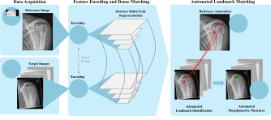

<p align="center">
  <h1 align="center"> An Artificial Intelligence Framework for Universal Landmark Matching and Morphometry in Musculoskeletal Radiography</h1>
  <p align="center">
    Dennis Eschweiler
    ·
    Eneko Cornejo Merodio
    ·
    Felix Barajas Ordonez
    ·
    Aleksandar Lichev
    ·
    Nikol Ignatova
    ·
    Marc Sebastian von der Stück
    ·
    Christiane Kuhl
    ·
    Daniel Truhn
    ·
    Sven Nebelung
  </p>
  <h2 align="center"><p>
    <a href="tba" align="center">Paper</a> | 
    <a href="https://truhnlab.github.io/RadiographLandmarkMatching/" align="center">Project Page</a>
  </p></h2>
  <div align="center"></div>
</p>
<p align="center">
    
    <br>
    <em>This AI framework enables precise, automated morphometric measurements by transferring landmarks from a single annotated reference radiograph to previously unseen images using dense matching. It performs reliably across diverse anatomies without the need for additional training.</em>
</p>

## Bibtex

If you find this project useful for your work, please consider citing it:
```
@article{eschweiler2025zeroshotmsklandmark,
 title={Zero-Shot Artificial Intelligence-based Landmark Matching for Versatile and Anatomy-Agnostic Radiograph Analysis},
 author={Dennis Eschweiler and Eneko Cornejo Merodio and Marc Sebastian Huppertz and Aleksandar Lichev and Nikol Ignatova and Daniel Truhn and Christiane Kuhl and Sven Nebelung},
 year={2025}
}
```

## Acknowledgments

This repository builds upon the work "Robust Dense Feature Matching" by Edstedt et al. We gratefully acknowledge their contribution, which forms the core matching algorithm of our medical imaging application. The original RoMa repository is available at: https://github.com/Parskatt/RoMa.

If you use this project, please also consider citing the original RoMa paper:
```
@article{edstedt2024roma,
  title={{RoMa: Robust Dense Feature Matching}},
  author={Edstedt, Johan and Sun, Qiyu and Bökman, Georg and Wadenbäck, Mårten and Felsberg, Michael},
  journal={IEEE Conference on Computer Vision and Pattern Recognition},
  year={2024}
}
```

# Quick Start


## Option 1: Manual Usage
### Prerequisites
- Python environment with required packages (see `requirements.txt`)
- Reference images with annotated landmarks
- Target images for analysis


### 1. Landmark Matching (`do_matching.py`)
Matches landmarks from reference images to target images using RoMa (Robust Matching) algorithm.

**Basic Usage:**
```bash
python do_matching.py \
  --reference_path "path/to/reference/images" \
  --data_path "path/to/target/images" \
  --save_path "path/to/output" \
  --config_tag "knee_lateral"
```

**Key Parameters:**
- `--reference_path`: Directory containing reference images (`*_image.jpg`) and landmarks (`*_landmarks.csv`)
- `--data_path`: Directory with target images to analyze
- `--save_path`: Output directory for matches and results
- `--reference_left_file` / `--reference_right_file`: Optional laterality check references
- `--max_matching_error`: Maximum allowed Procrustes error (default: 500)
- `--coarse_res` / `--upsample_res`: Model resolution settings

**Output:**
- Individual match visualizations (`{ref_id}_to_{target_id}.png`)
- Landmark coordinates (`{ref_id}_to_{target_id}_matches.csv`)
- Matching metrics (`{ref_id}_to_{target_id}_metrics.json`)
- Consensus landmarks (`{target_id}_matches_bulk.csv`)

### 2. Measurements (`do_measurements.py`)
Calculates clinical measurements from matched landmarks using predefined measurement functions.

**Basic Usage:**
```bash
python do_measurements.py \
  --data_path "path/to/landmark/files" \
  --save_path "path/to/output" \
  --config_tag "knee_lateral" \
  --config_path "experiment_config_windows.json"
```

**Key Parameters:**
- `--data_path`: Directory containing `*_matches_bulk.csv` files from matching step
- `--config_tag`: Configuration key from experiment config (e.g., "knee_lateral", "feet_lateral")
- `--config_path`: Path to experiment configuration file
- `--save_path`: Output directory for measurement results

**Output:**
- Measurement CSV file (`measurements_{config_tag}.csv`) with calculated values for each image

### Configuration
The `experiment_config_windows.json` file contains measurement configurations:
- `mode`: Measurement type (e.g., "knee_lateral", "feet_lateral")
- `mpp`: Millimeters per pixel conversion factor
- Measurement-specific parameters

### Example Workflow
```bash
# 1. Match landmarks
python do_matching.py \
  --reference_path "E:/data/UKAKneeX/LATERAL_ALL/*" \
  --data_path "C:/path/to/target/images" \
  --save_path "C:/path/to/results" \
  --config_tag "knee_lateral"

# 2. Calculate measurements
python do_measurements.py \
  --data_path "C:/path/to/results" \
  --save_path "C:/path/to/results" \
  --config_tag "knee_lateral"
```


## Option 2: Docker (Work in Progress)
The recommended way to run this project is using Docker with the production integration script:

- Tested with Python 3.10
- Docker recommended with NVIDIA support for GPU acceleration

**Production Usage:**
```python
from docker.run_production import RomaMedicalDocker

# Initialize Docker runner
roma_docker = RomaMedicalDocker("roma_medical:latest")

# Run matching with temporary directories (matches project architecture)
results = roma_docker.run_matching(
    data_path="/path/to/target/images",           # Folder containing images to analyze
    reference_path="/path/to/reference/files",   # Folder with reference images & landmarks
    reference_left_path="/path/to/left/ref",     # Base path for left laterality check
    reference_right_path="/path/to/right/ref",   # Base path for right laterality check
    output_dir="/path/to/save/results",          # Where to save results permanently
    max_matching_error=500,
    image_filetype="jpg"
)
```

**Build Instructions (Required First Step):**

⚠️ **Important**: You must build the Docker image before using it.

```bash
# From the main project directory (roma_medical/)
docker build -f docker/Dockerfile -t roma_medical:latest .
```
For detailed Docker documentation, see [`docker/README.md`](docker/README.md).

