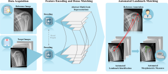

<p align="center">
  <h1 align="center"> An Artificial Intelligence Framework for Universal Landmark Matching and Morphometry in Musculoskeletal Radiography</h1>
  <p align="center">
    Dennis Eschweiler
    ·
    Eneko Cornejo Merodio
    ·
    Felix Barajas Ordonez
    ·
    Aleksandar Lichev
    ·
    Nikol Ignatova
    ·
    Marc Sebastian von der Stück
    ·
    Christiane Kuhl
    ·
    Daniel Truhn
    ·
    Sven Nebelung
  </p>
  <h2 align="center"><p>
    <a href="https://doi.org/10.1007/s00330-026-12555-y" align="center">Paper</a> &nbsp; · &nbsp;  
    <a href="https://truhnlab.github.io/RadiographLandmarkMatching/" align="center">Project Page</a>
  </p></h2>
  <div align="center"></div>
</p>
<p align="center">
    
    <br>
    <em>This AI framework enables precise, automated morphometric measurements by transferring landmarks from a single annotated reference radiograph to previously unseen images using dense matching. It performs reliably across diverse anatomies without the need for additional training.</em>
</p>

## Related Projects

Projects that used this framework as a tool:

- **[AI Challenges the Reference Standards for Lateral Knee Morphometry](https://doi.org/...)**<br>
  > Many clinical reference values were fixed decades ago from small patient groups and never tested at scale. Using automated AI landmark measurement on more than 41,000 lateral knee radiographs from two independent health systems, we show that the most widely used patellar height threshold systematically misclassifies knees without reported imaging finding, demonstrating how automated morphometry can re-evaluate inherited diagnostic standards.
  <details>
  <summary>Bibtex</summary>

  ```
  @article{tba,
    title={...},
    author={...},
    journal={...},
    year={2026},
    doi={...}
  }
  ```
  </details>

- **[On the symmetry of the contralateral knee](https://doi.org/...)**<br>
  > The contralateral knee is widely used as a reference in patellofemoral radiography, but how much side-to-side difference a routine radiograph can actually resolve has never been quantified. Using automated AI landmark measurement on more than 11,000 paired knee radiographs from a multi-site health system, we show that side-to-side differences in patellofemoral indices fall at the resolution floor of radiography itself, defining index-specific tolerance intervals within which the contralateral knee is a usable reference and beyond which it is not.
  <details>
  <summary>Bibtex</summary>

  ```
  @article{tba,
    title={...},
    author={...},
    journal={...},
    year={2026},
    doi={...}
  }
  ```
  </details>

## Bibtex

If you find this project useful for your work, please consider citing it:
```
@article{eschweiler2026RadiographMatching,
  title={An Artificial Intelligence Framework for Universal Landmark Matching and Morphometry in Musculoskeletal Radiography},
  author={Dennis Eschweiler and Eneko Cornejo Merodio and Felix Barajas Ordonez and Aleksandar Lichev and Nikol Ignatova and Marc Sebastian von der St{\"u}ck and Christiane K. Kuhl and Daniel Truhn and Sven Nebelung},
  journal={European Radiology},
  pages={1--14},
  year={2026},
  doi={10.1007/s00330-026-12555-y}
}
```

## Acknowledgments

This repository builds upon the work "Robust Dense Feature Matching" by Edstedt et al. We gratefully acknowledge their contribution, which forms the core matching algorithm of our medical imaging application. The original RoMa repository is available at: https://github.com/Parskatt/RoMa.

If you use this project, please also consider citing the original RoMa paper:
```
@article{edstedt2024roma,
  title={{RoMa: Robust Dense Feature Matching}},
  author={Edstedt, Johan and Sun, Qiyu and Bökman, Georg and Wadenbäck, Mårten and Felsberg, Michael},
  journal={IEEE Conference on Computer Vision and Pattern Recognition},
  year={2024}
}
```

# Quick Start


## Option 1: Manual Usage
### Prerequisites
- Python environment with required packages (see `requirements.txt`)
- Reference images with annotated landmarks
- Target images for analysis


### 1. Landmark Matching (`do_matching.py`)
Matches landmarks from reference images to target images using RoMa (Robust Matching) algorithm.

**Basic Usage:**
```bash
python do_matching.py \
  --reference_path "path/to/reference/images" \
  --data_path "path/to/target/images" \
  --save_path "path/to/output"
```

**Key Parameters:**
- `--reference_path`: Directory containing reference images (`*_image.jpg`) and landmarks (`*_landmarks.csv`); searched recursively, so per-case subfolders work too
- `--data_path`: Directory with target images to analyze
- `--save_path`: Output directory for matches and results
- `--image_filetype`: Image extension of references and targets (default: `jpg`)
- `--num_references`: How many references to match against (`-1` = all; default `-1`)
- `--reference_rank_file`: Optional JSON ranking to select the top-N references (default: none, so the first N by name are used)
- `--max_matching_error`: Maximum allowed Procrustes error (default: 500)
- `--coarse_res` / `--upsample_res`: Model resolution settings

**Output** (per target image, under `save_path`):
- Per-reference landmarks (`{target_id}_matches/{ref_id}_to_{target_id}_matches.csv`)
- Consensus landmarks (`{target_id}_matches_bulk.csv`) + overlay (`{target_id}_matches_bulk.svg`)
- Per-reference Procrustes errors (`{target_id}_matches_bulk_procrustes.json`)

### 2. Measurements (`do_measurements.py`)
Calculates clinical measurements from matched landmarks using predefined measurement functions.

**Basic Usage:**
```bash
python do_measurements.py \
  --data_path "path/to/landmark/files" \
  --save_path "path/to/output" \
  --config_tag "knee_lateral" \
  --config_path "experiment_config_windows.json"
```

**Key Parameters:**
- `--data_path`: Directory containing `*_matches_bulk.csv` files from matching step
- `--config_tag`: Configuration key from experiment config (e.g., "knee_lateral", "feet_lateral")
- `--config_path`: Path to experiment configuration file
- `--save_path`: Output directory for measurement results

**Output:**
- Measurement CSV file (`measurements_{config_tag}.csv`) with calculated values for each image

### Configuration
The `experiment_config_windows.json` file contains measurement configurations:
- `mode`: Measurement type (e.g., "knee_lateral", "feet_lateral")
- `mpp`: Millimeters per pixel conversion factor
- Measurement-specific parameters

### Example Workflow
```bash
# 1. Match landmarks
python do_matching.py \
  --reference_path "C:/path/to/reference/images" \
  --data_path "C:/path/to/target/images" \
  --save_path "C:/path/to/results"

# 2. Calculate measurements
python do_measurements.py \
  --data_path "C:/path/to/results" \
  --save_path "C:/path/to/results" \
  --config_tag "knee_lateral" \
  --config_path "experiment_config_windows.json"
```


## Option 2: Dockerized inference service (self-hosted)
You can run the pipeline as a self-hosted service on your own GPU machine. The RoMa
model loads once and stays in memory; clients send a radiograph with `anatomy` and
`projection` (and optional `mpp`) and get back the consensus landmarks and
measurements. This repo provides the code and tooling to deploy it; it is not a
hosted endpoint. Once running, it is reachable two ways:

- REST: `POST /process` (multipart image upload).
- MCP: a remote MCP server at `/mcp` for AI agents.

A Caddy HTTPS proxy with API-key auth fronts the model and MCP containers; the whole
stack is managed by [`docker/service.sh`](docker/service.sh). Weights and reference
sets are mounted at runtime.

```bash
# on your GPU machine (settings in service.env; see docker/README.md)
./service.sh start
./service.sh status
```

```bash
# REST call (self-signed cert, so curl -k)
curl -k -X POST https://<server>/process -H "X-API-Key: <key>" \
  -F "image=@target.jpg" -F "anatomy=knee" -F "projection=lateral"
```

Full setup, reference layout, the REST contract, and MCP integration are in
[`docker/README.md`](docker/README.md).

